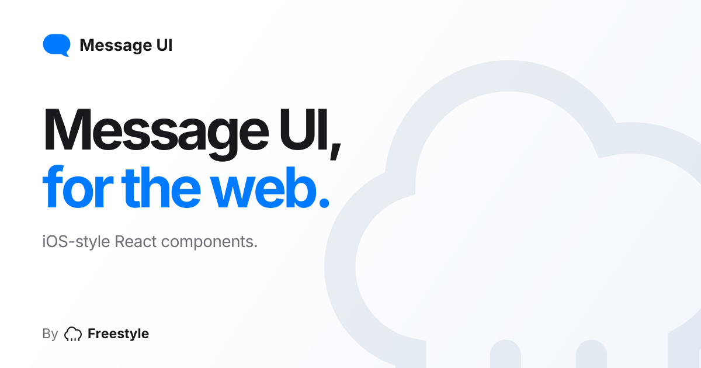

# Message UI

iOS-style React components for the web. Install with shadcn, own the source, and make it yours.

[Explore components](https://imessage.swerdlow.dev/components) · [Try the demo](https://imessage.swerdlow.dev) · [Add to your agent](https://imessage.swerdlow.dev/onboard.md) · [MIT license](LICENSE)



Message bubbles, Tapbacks, photos, voice messages, link previews, typing indicators, composers,
conversation lists, and contact views. Use a single component or a complete conversation shell.
The playground includes color controls, preview sizes, and light and dark themes.

These are UI components. Connect your own message data, uploads, audio, and send handlers.

## Install

Start with a React 19 and Tailwind CSS 4 project configured for shadcn.

```sh
npx shadcn@latest add https://imessage.swerdlow.dev/r/message-bubble.json https://imessage.swerdlow.dev/r/palette.json
```

Components are copied into `components/message-ui/` and use your project's `@/lib/utils` helper.

```tsx
import { MessageBubble } from "@/components/message-ui/message-bubble";
import { PaletteStyle } from "@/components/message-ui/palette";

export function Hello() {
  return (
    <div data-im-platform="ios">
      <PaletteStyle platform="ios" />
      <MessageBubble platform="ios" direction="outgoing" tail>
        Oh hey. You made it.
      </MessageBubble>
    </div>
  );
}
```

For a complete app shell:

```sh
npx shadcn@latest add https://imessage.swerdlow.dev/r/ios-messages-app.json
```

You can also add the registry to your existing `components.json`:

```json
{
  "registries": {
    "@message-ui": "https://imessage.swerdlow.dev/r/{name}.json"
  }
}
```

Then install individual components with `npx shadcn@latest add @message-ui/ios-conversation-list`.
Each [component page](https://imessage.swerdlow.dev/components) includes its preview, source, and installation command.

## Use with your agent

Paste this into Claude Code, Codex, Cursor, or your preferred coding agent:

```text
Read https://imessage.swerdlow.dev/onboard.md and install the Message UI skill.
Use it when building Messages-style interfaces in my projects.
```

The [agent index](https://imessage.swerdlow.dev/llms.txt) includes installation and usage guidance for every registry item.

## Run locally

Requires [Bun](https://bun.sh).

```sh
git clone https://github.com/theswerd/imessage-ui.git
cd imessage-ui
bun install --frozen-lockfile
bun run dev
```

Open [localhost:3100](http://localhost:3100). For production, set `REGISTRY_URL` to your public origin
before running `bun run build`, then run `bun run start`.

## Contributing

Bug fixes, accessibility improvements, and better previews are welcome. See [CONTRIBUTING.md](CONTRIBUTING.md)
for setup and checks, and the [development guide](docs/development.md) for the harness and native measurements.

Geometry and motion are informed by native captures. Source comments and the
[measurement spec](references/SPEC.md) identify approximations and remaining gaps.
Browser regression screenshots verify consistency; native simulator captures provide separate reference evidence.

## License and credits

Project code is [MIT licensed](LICENSE). Fonts, third-party marks, demonstration media, and native
reference captures have separate terms; see [THIRD_PARTY_NOTICES.md](THIRD_PARTY_NOTICES.md).

By [Ben Swerdlow](https://twitter.com/benswerd) ◇ [Freestyle](https://www.freestyle.sh).
